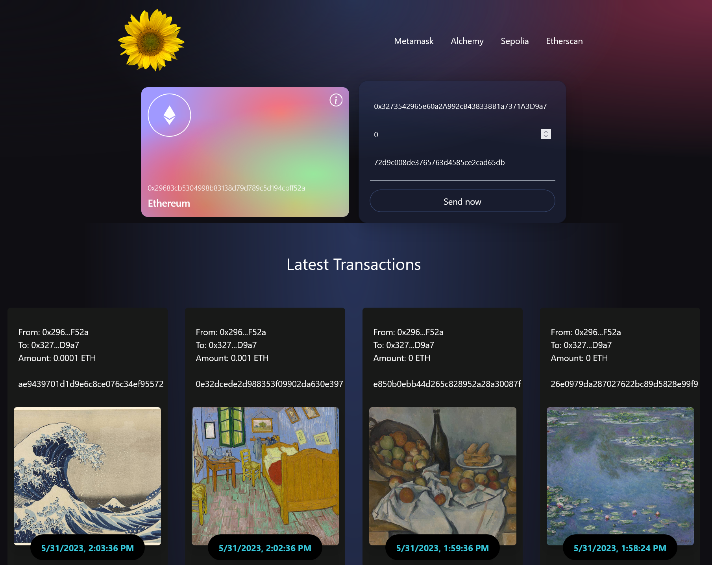
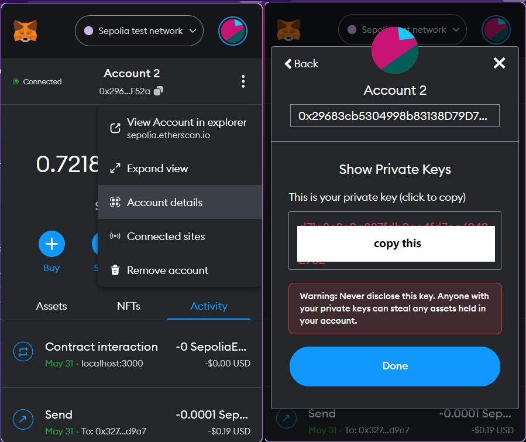
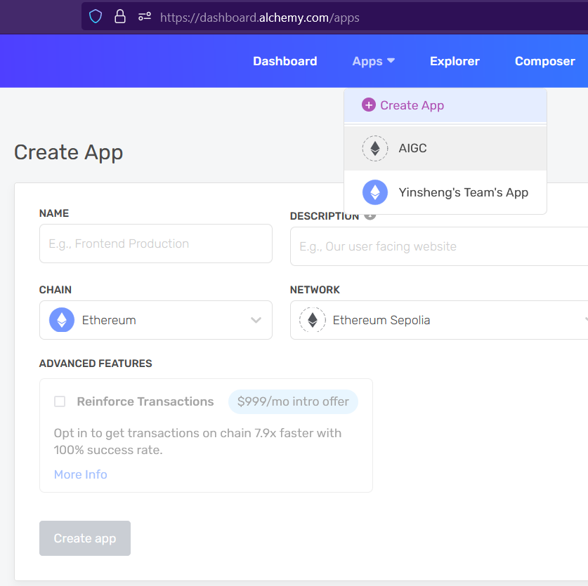
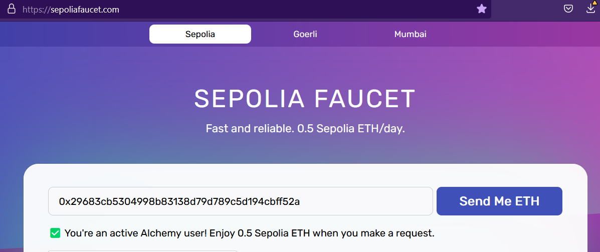

# Web 3.0 Blockchain Application

This project is based on this Web3.0 tutorial (https://www.youtube.com/watch?v=Wn_Kb3MR_cU).



This dApp allows users to store the hash code (unique digital fingerprint) of an asset (e.g., images) to the blockchain via an ethereum smart contract.  
Note: The image is stored in local server, but its hash code is stored in the blockchain.

# Steps

## configure hardhat.config.js

1. Copy and paste your private key from metamask (see below)


2. create a dApp on alchemy.com (https://www.alchemy.com/)
  
Note: The dApp is deployed on sepolia testnet, not the mainnet.

3. Copy and paste the https link.


4. The completed hardhat.config.js file should look like this:

```
require("@nomiclabs/hardhat-waffle");
module.exports = {
  solidity: "0.8.9",
  networks: {
    sepolia: {
      url: "https://eth-sepolia.g.alchemy.com/v2/JA5X0KC_sVNPzgVa2lalkbYW0hfq2HOY",
      accounts : ['your prviate key (get from metamask)'],
    }
  }
}
```

## Write the smart contract (Transaction.sol).

This contract defines and stores a struct to the blockchain.  

1. Setup env and compile the contract.

```
cd smart_contract
npm install hardhat @nomiclabs/hardhat-waffle ethereum-waffle chai @nomiclabs/hardhat-ethers ethers @nomiclabs/hardhat-etherscan
npx hardhat help
npx hardhat test
npx hardhat run scripts/deploy.js --network sepolia

    Transactions address: 0xE2DaBD738A3f5F434925d32Ff1e8B4AF3b63Fe94 (copy this to contractAddress in constants.js; each run will differ)

Sensative data that need kept locally:  
    hardhat.config.js (contains private key)
```

2. copy the Transaction.json file to the client/src/abis folder.

Transaction.json is the ABI (Application Binary Interface) file that defines the smart contract.

3. Copy the contract address to the client/src/constants.js file.

## Build the nodejs app.

```
cd client
npm init vite@latest
npm install tailwindcss react-icons ethers
npm run dev
```

The dApp needs gas to operate. Get some sepoliaETH from https://faucet.sepolia.com/ (you need to have a sepolia account).



Run prepare_imageset.ipynb to resize and rename images and store them to the ./client/images folder.

## Deploy on CentOS + nginx

```
# curl -sL https://rpm.nodesource.com/setup_16.x | sudo bash -
# sudo yum install -y nodejs
```

Enter the src folder in server.  
```
sudo npm install
sudo npm run build
``` 

Copy /images to /dist and set the /dist as the website's working folder.   
Set the website's php version to static (php not needed).  

Finished.